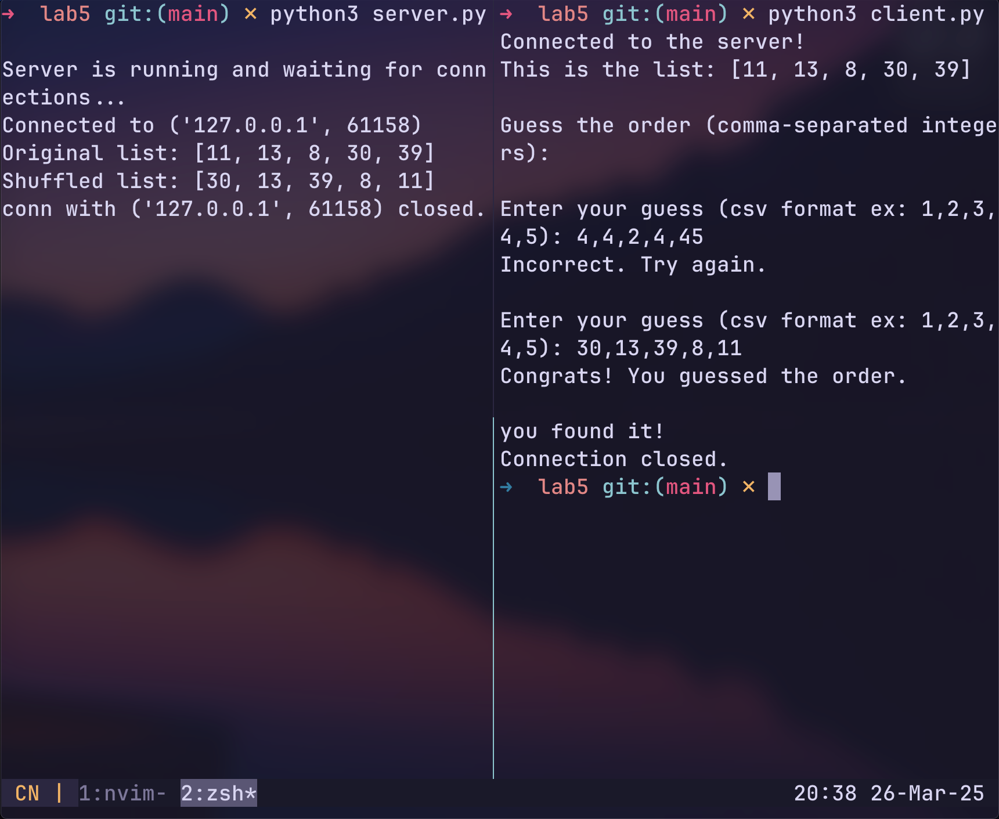

# **Guess the Shuffled List Game**

A simple server-client game where you guess the
shuffled order of a random list. Can you crack
the code? 🧩

---

## Example run.

## 🚀 **How to Play**

1. **Run the Server**: Start `server.py` to generate a random list.
2. **Connect as a Client**: Run `client.py` to play the game.
3. **Guess the Order**: Enter your guess (e.g., `23,12,45,10,34`).
4. **Win**: Guess correctly to win! 🎉

---

## 📂 **Files**

- `server.py`: Hosts the game.
- `client.py`: Connects to the server.

---

## 🌟 **Enjoy!**
~ml3m
